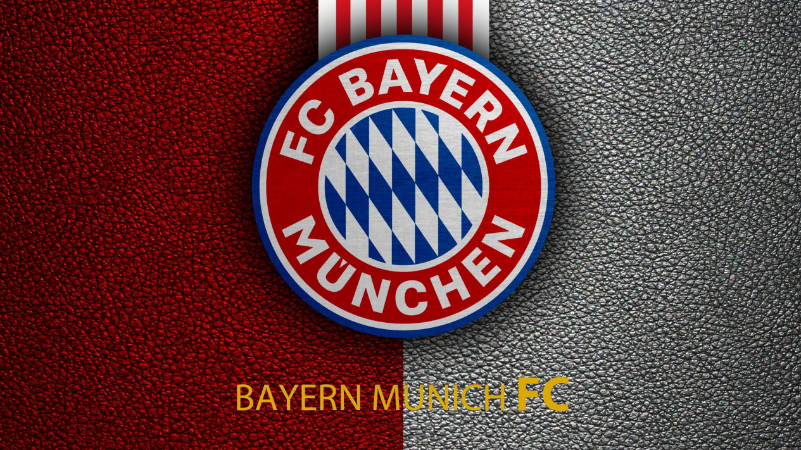

  

# Fully native web app!

## Contributors
<table>
    <tr>
        <td>Putranto Surya Wijanarko</td>
        <td>H1D023048</td>
        <td>putranto.wijanarko@mhs.unsoed.ac.id</td>
    </tr>
    <tr>
        <td>Nadzare Kafah Alfatiha</td>
        <td>H1D023014</td>
        <td>nadzare.alfatiha@mhs.unsoed.ac.id</td>
    </tr>
</table>

## Requirements
- PHP (8.1.10)
- MySQL (8.0.30)
- Composer
> This can be done using laragon as per v.6.0-220916

## What's in this?
- [ ] Transfer Simulation
- [ ] Current Formation
- [ ] Current Player and Manager
- [ ] Leaderboards
- [ ] Merchandise

## How To Run
Clone this repository
```bash
git clone https://github.com/Samestora/responsi-BM-7.git
cd responsi-BM-7
```

Rename the environment variable and edit it as much as you like
```bash
mv src/example.env .env
```
Make sure that `composer` and `php executable` are installed, then
```bash
cd Public
composer dump-autoload
php -S localhost:8000
```

## Development
### FrontEnd :
- Views/ (The directory for html stuffs)
- Views/* (Instead of about.php, it's about/index.php)
- Public/Assets (CSS, JS, IMG, etc)
- Public/ (Host there)
- Shortcodes/ (Reusable component)

### BackEnd :
- Migrate/ (DB structure and data)
- Models/ (DB retrieved and sent data format)
- Db/ (DB PDO Connection)